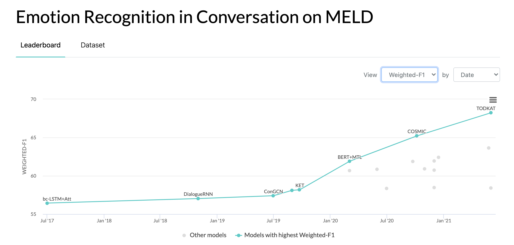
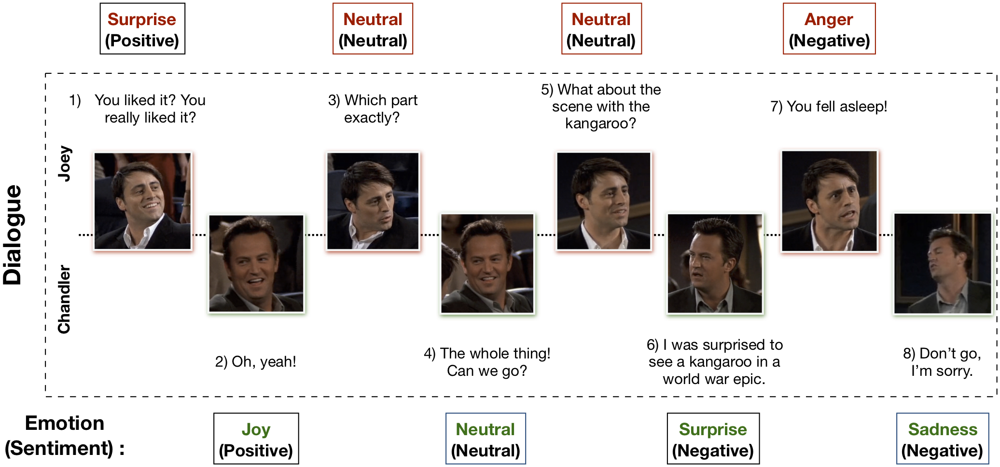

# MELD: A Multimodal Multi-Party Dataset for Emotion Recognition in Conversation

## Note

:fire: We have released the visual features extracted using Resnet - https://github.com/declare-lab/MM-Align

:fire: :fire: :fire: For updated baselines please visit this link: [conv-emotion](https://github.com/declare-lab/conv-emotion)

:fire: :fire: :fire: For downloading the data use wget: 
```wget http://web.eecs.umich.edu/~mihalcea/downloads/MELD.Raw.tar.gz```

## Leaderboard



## Updates

10/10/2020: New paper and SOTA in Emotion Recognition in Conversations on the MELD dataset. Refer to the directory [COSMIC](https://github.com/declare-lab/conv-emotion/tree/master/COSMIC) for the code. Read the paper -- [COSMIC: COmmonSense knowledge for eMotion Identification in Conversations](https://arxiv.org/pdf/2010.02795.pdf).

22/05/2019: MELD: A Multimodal Multi-Party Dataset for Emotion Recognition in Conversation has been accepted as a full paper at ACL 2019. The updated paper can be found here - https://arxiv.org/pdf/1810.02508.pdf

22/05/2019: Dyadic MELD has been released. It can be used to test dyadic conversational models.

15/11/2018: The problem in the train.tar.gz has been fixed. 

## Research Works using MELD

Zhang, Yazhou, Qiuchi Li, Dawei Song, Peng Zhang, and Panpan Wang. "Quantum-Inspired Interactive Networks for Conversational Sentiment Analysis." IJCAI 2019.

Zhang, Dong, Liangqing Wu, Changlong Sun, Shoushan Li, Qiaoming Zhu, and Guodong Zhou. "Modeling both Context-and Speaker-Sensitive Dependence for Emotion Detection in Multi-speaker Conversations." IJCAI 2019.

Ghosal, Deepanway, Navonil Majumder, Soujanya Poria, Niyati Chhaya, and Alexander Gelbukh. "DialogueGCN: A Graph Convolutional Neural Network for Emotion Recognition in Conversation." EMNLP 2019.


----------------------------------------------------

## Introduction
Multimodal EmotionLines Dataset (MELD) has been created by enhancing and extending EmotionLines dataset. MELD contains the same dialogue instances available in EmotionLines, but it also encompasses audio and visual modality along with text. MELD has more than 1400 dialogues and 13000 utterances from Friends TV series. Multiple speakers participated in the dialogues. Each utterance in a dialogue has been labeled by any of these seven emotions -- Anger, Disgust, Sadness, Joy, Neutral, Surprise and Fear. MELD also has sentiment (positive, negative and neutral) annotation for each utterance.

### Example Dialogue


### Dataset Statistics
| Statistics                      | Train   | Dev     | Test    |
|---------------------------------|---------|---------|---------|
| # of modality                   | {a,v,t} | {a,v,t} | {a,v,t} |
| # of unique words               | 10,643  | 2,384   | 4,361   |
| Avg. utterance length           | 8.03    | 7.99    | 8.28    |
| Max. utterance length           | 69      | 37      | 45      |
| Avg. # of emotions per dialogue | 3.30    | 3.35    | 3.24    |
| # of dialogues                  | 1039    | 114     | 280     |
| # of utterances                 | 9989    | 1109    | 2610    |
| # of speakers                   | 260     | 47      | 100     |
| # of emotion shift              | 4003    | 427     | 1003    |
| Avg. duration of an utterance   | 3.59s   | 3.59s   | 3.58s   |

Please visit https://affective-meld.github.io for more details.

### Dataset Distribution

|          | Train | Dev | Test |
|----------|-------|-----|------|
| Anger    | 1109  | 153 | 345  |
| Disgust  | 271   | 22  | 68   |
| Fear     | 268   | 40  | 50   |
| Joy      | 1743  | 163 | 402  |
| Neutral  | 4710  | 470 | 1256 |
| Sadness  | 683   | 111 | 208  |
| Surprise | 1205  | 150 | 281  |


## Purpose
Multimodal data analysis exploits information from multiple-parallel data channels for decision making. With the rapid growth of AI, multimodal emotion recognition has gained a major research interest, primarily due to its potential applications in many challenging tasks, such as dialogue generation, multimodal interaction etc. A conversational emotion recognition system can be used to generate appropriate responses by analysing user emotions. Although there are numerous works carried out on multimodal emotion recognition, only a very few actually focus on understanding emotions in conversations. However, their work is limited only to dyadic conversation understanding and thus not scalable to emotion recognition in multi-party conversations having more than two participants. EmotionLines can be used as a resource for emotion recognition for text only, as it does not include data from other modalities such as visual and audio. At the same time, it should be noted that there is no multimodal multi-party conversational dataset available for emotion recognition research. In this work, we have extended, improved, and further developed EmotionLines dataset for the multimodal scenario. Emotion recognition in sequential turns has several challenges and context understanding is one of them. The emotion change and emotion flow in the sequence of turns in a dialogue make accurate context modelling a difficult task. In this dataset, as we have access to the multimodal data sources for each dialogue, we hypothesise that it will improve the context modelling thus benefiting the overall emotion recognition performance.  This dataset can also be used to develop a multimodal affective dialogue system. IEMOCAP, SEMAINE are multimodal conversational datasets which contain emotion label for each utterance. However, these datasets are dyadic in nature, which justifies the importance of our Multimodal-EmotionLines dataset. The other publicly available multimodal emotion and sentiment recognition datasets are MOSEI, MOSI, MOUD. However, none of those datasets is conversational.

## Dataset Creation
The first step deals with finding the timestamp of every utterance in each of the dialogues present in the EmotionLines dataset. To accomplish this, we crawled through the subtitle files of all the episodes which contains the beginning and the end timestamp of the utterances. This process enabled us to obtain season ID, episode ID, and timestamp of each utterance in the episode. We put two constraints whilst obtaining the timestamps: (a) timestamps of the utterances in a dialogue must be in increasing order, (b) all the utterances in a dialogue have to belong to the same episode and scene.
Constraining with these two conditions revealed that in EmotionLines, a few dialogues consist of multiple natural dialogues. We filtered out those cases from the dataset. Because of this error correction step, in our case, we have the different number of dialogues as compare to the EmotionLines. After obtaining the timestamp of each utterance, we extracted their corresponding audio-visual clips from the source episode. Separately, we also took out the audio content from those video clips. Finally, the dataset contains visual, audio, and textual modality for each dialogue.

## Paper
The paper explaining this dataset can be found - https://arxiv.org/pdf/1810.02508.pdf

## Download the data
Please visit - http://web.eecs.umich.edu/~mihalcea/downloads/MELD.Raw.tar.gz to download the raw data. Data are stored in .mp4 format and can be found in XXX.tar.gz files. Annotations can be found in https://github.com/declare-lab/MELD/tree/master/data/MELD.

## Description of the .csv files

### Column Specification
| Column Name  | Description                                                                                                                                                                                                                                                                                                                                                                                                                                                                                                                                            |
|--------------|--------------------------------------------------------------------------------------------------------------------------------------------------------------------------------------------------------------------------------------------------------------------------------------------------------------------------------------------------------------------------------------------------------------------------------------------------------------------------------------------------------------------------------------------------------|
| Sr No.       | Serial numbers of the utterances mainly for referencing the utterances in case of different versions or multiple copies with different subsets |
| Utterance    | Individual utterances from EmotionLines as a string.                                                                                                                                                                                                                                                                                                                                                                                                                                                                                                   |
| Speaker      | Name of the speaker associated with the utterance.                                                                                                                                                                                                                                                                                                                                                                                                                                                                                                     |
| Emotion      | The emotion (neutral, joy, sadness, anger, surprise, fear, disgust) expressed by the speaker in the utterance.                                                                                                                                                                                                                                                                                                                                                                                                                                         |
| Sentiment    | The sentiment (positive, neutral, negative) expressed by the speaker in the utterance.                                                                                                                                                                                                                                                                                                                                                                                                                                                                 |
| Dialogue_ID  | The index of the dialogue starting from 0.                                                                                                                                                                                                                                                                                                                                                                                                                                                                                                             |
| Utterance_ID | The index of the particular utterance in the dialogue starting from 0.                                                                                                                                                                                                                                                                                                                                                                                                                                                                                 |
| Season       | The season no. of Friends TV Show to which a particular utterance belongs.                                                                                                                                                                                                                                                                                                                                                                                                                                                                             |
| Episode      | The episode no. of Friends TV Show in a particular season to which the utterance belongs.                                                                                                                                                                                                                                                                                                                                                                                                                                                              |
| StartTime    | The starting time of the utterance in the given episode in the format 'hh:mm:ss,ms'.                                                                                                                                                                                                                                                                                                                                                                                                                                                                   |
| EndTime      | The ending time of the utterance in the given episode in the format 'hh:mm:ss,ms'.                                                                                                                                                                                                                                                                                                                                                                                                                                                                     |

### The files
- /data/MELD/train_sent_emo.csv - contains the utterances in the training set along with Sentiment and Emotion labels.
- /data/MELD/dev_sent_emo.csv - contains the utterances in the dev set along with Sentiment and Emotion labels.
- /data/MELD/test_sent_emo.csv - contains the utterances in the test set along with Sentiment and Emotion labels.
- /data/MELD_Dyadic/train_sent_emo_dya.csv - contains the utterances in the training set of the dyadic variant of MELD along with Sentiment and Emotion labels. For getting the video clip corresponding to a particular utterance refer to the columns 'Old_Dialogue_ID' and 'Old_Utterance_ID'.
- /data/MELD_Dyadic/dev_sent_emo_dya.csv - contains the utterances in the dev set of the dyadic variant along with Sentiment and Emotion labels. For getting the video clip corresponding to a particular utterance refer to the columns 'Old_Dialogue_ID' and 'Old_Utterance_ID'.
- /data/MELD_Dyadic/test_sent_emo_dya.csv - contains the utterances in the test set of the dyadic variant along with Sentiment and Emotion labels. For getting the video clip corresponding to a particular utterance refer to the columns 'Old_Dialogue_ID' and 'Old_Utterance_ID'.

## Description of Pickle Files
There are 13 pickle files comprising of the data and features used for training the baseline models. Following is a brief description of each of the pickle files.

### Data pickle files:

* **data_emotion.p, data_sentiment.p** - These are the primary data files which contain 5 different elements stored as a list.
    * *data*: It consists of a dictionary with the following key/value pairs.
        * *text*: original sentence.
        * *split*: train/val/test - denotes the which split the tuple belongs to.
        * *y*: label of the sentence.
        * *dialog*: ID of the dialog the utterance belongs to.
        * *utterance*: utterance number of the dialog ID.
        * *num_words*: number of words in the utterance.
    * W: glove embedding matrix
    * vocab: the vocabulary of the dataset
    * word_idx_map: mapping of each word from vocab to its index in W.
    * max_sentence_length: maximum number of tokens in an utterance in the dataset.
    * label_index: mapping of each label (emotion or sentiment) to its assigned index, eg. label_index['neutral']=0               
```python
import pickle
data, W, vocab, word_idx_map, max_sentence_length, label_index = pickle.load(open(filepath, 'rb'))
```

* **text_glove_average_emotion.pkl, text_glove_average_sentiment.pkl** - It consists of 300 dimensional textual feature vectors of each utterance initialized as the average of the Glove embeddings of all tokens per utterance. It is a list comprising of 3 dictionaries for train, val and the test set with each dictionary indexed in the format *dia_utt*, where dia is the dialogue id and utt is the utterance id. For eg. train_text_avg_emb['0_0'].shape = (300, )
```python
import pickle
train_text_avg_emb, val_text_avg_emb, test_text_avg_emb = pickle.load(open(filepath, 'rb'))
```


* **audio_embeddings_feature_selection_emotion.pkl,audio_embeddings_feature_selection_sentiment.pkl** - It consists of 1611/1422 dimensional audio feature vectors of each utterance trained for emotion/sentiment classification. These features are originally extracted from [openSMILE](https://www.audeering.com/opensmile/) and then followed by L2-based feature selection using SVM. It is a list comprising of 3 dictionaries for train, val and the test set with each dictionary indexed in the format *dia_utt*, where dia is the dialogue id and utt is the utterance id. For eg. train_audio_emb['0_0'].shape = (1611, ) or (1422, )
```python
import pickle
train_audio_emb, val_audio_emb, test_audio_emb = pickle.load(open(filepath, 'rb'))
```


### Model output pickle files:

* **text_glove_CNN_emotion.pkl, text_glove_CNN_sentiment.pkl** - It consists of 100 dimensional textual features obtained after training on a CNN-based [network](https://github.com/dennybritz/cnn-text-classification-tf) for emotion/sentiment calssification. It is a list comprising of 3 dictionaries for train, val and the test set with each dictionary indexed in the format *dia_utt*, where dia is the dialogue id and utt is the utterance id. For eg. train_text_CNN_emb['0_0'].shape = (100, )
```python
import pickle
train_text_CNN_emb, val_text_CNN_emb, test_text_CNN_emb = pickle.load(open(filepath, 'rb'))
```

* **text_emotion.pkl, text_sentiment.pkl** - These files contain the contextual feature representations as produced by the uni-modal bcLSTM model. It consists of 600 dimensional textual feature vector for each utterance for emotion/sentiment classification stored as a dictionary indexed with dialogue id. It is a list comprising of 3 dictionaries for train, val and the test set. For eg. train_text_emb['0'].shape = (33, 600), where 33 is the maximum number of utterances in a dialogue. Dialogues with less utterances are padded with zero-vectors.
```python
import pickle
train_text_emb, val_text_emb, test_text_emb = pickle.load(open(filepath, 'rb'))
```

* **audio_emotion.pkl, audio_sentiment.pkl** - These files contain the contextual feature representations as produced by the uni-modal bcLSTM model. It consists of 300/600 dimensional audio feature vector for each utterance for emotion/sentiment classification stored as a dictionary indexed with dialogue id. It is a list comprising of 3 dictionaries for train, val and the test set. For eg. train_audio_emb['0'].shape = (33, 300) or (33, 600), where 33 is the maximum number of utterances in a dialogue. Dialogues with less utterances are padded with zero-vectors.
```python
import pickle
train_audio_emb, val_audio_emb, test_audio_emb = pickle.load(open(filepath, 'rb'))
```


* **bimodal_sentiment.pkl** - This file contains the contextual feature representations as produced by the bi-imodal bcLSTM model. It consists of 600 dimensional bimodal (text, audio) feature vector for each utterance for sentiment classification stored as a dictionary indexed with dialogue id. It is a list comprising of 3 dictionaries for train, val and the test set. For eg. train_bimodal_emb['0'].shape = (33, 600), where 33 is the maximum number of utterances in a dialogue. Dialogues with less utterances are padded with zero-vectors.
```python
import pickle
train_bimodal_emb, val_bimodal_emb, test_bimodal_emb = pickle.load(open(filepath, 'rb'))
```


## Description of Raw Data
- There are 3 folders (.tar.gz files)-train, dev and test; each of which corresponds to video clips from the utterances in the 3 .csv files.
- In any folder, each video clip in the raw data corresponds to one utterance in the corresponding .csv file. The video clips are named in the format: diaX1\_uttX2.mp4, where X1 is the Dialogue\_ID and X2 is the Utterance_ID as provided in the corresponding .csv file, denoting the particular utterance.
- For example, consider the video clip **dia6_utt1.mp4** in **train.tar.gz**. The corresponding utterance for this video clip will be in the file **train_sent_emp.csv** with **Dialogue_ID=6** and **Utterance_ID=1**, which is *'You liked it? You really liked it?'*

## Reading the Data
There are 2 python scripts provided in './utils/':
- read_meld.py \- displays the path of the video file corresponding to an utterance in the .csv file from MELD.
- read_emorynlp \- displays the path of the video file corresponding to an utterance in the .csv file from Multimodal EmoryNLP Emotion Detection dataset.

## Labelling
For experimentation, all the labels are represented as one-hot encodings, the indices for which are as follows:
- **Emotion** - {'neutral': 0, 'surprise': 1, 'fear': 2, 'sadness': 3, 'joy': 4, 'disgust': 5, 'anger': 6}. Therefore, the label corresponding to the emotion *'joy'* would be [0., 0., 0., 0., 1., 0., 0.]
- **Sentiment** - {'neutral': 0, 'positive': 1, 'negative': 2}. Therefore, the label corresponding to the sentiment *'positive'* would be [0., 1., 0.]

## Class Weights
For the baseline on emotion classification, the following class weights were used. The indexing is the same as mentioned above.
Class Weights: [4.0, 15.0, 15.0, 3.0, 1.0, 6.0, 3.0].

## Run the baseline

Please follow these steps to run the baseline - 

1. Download the features from [here](http://web.eecs.umich.edu/~mihalcea/downloads/MELD.Features.Models.tar.gz).
2. Copy these features into `./data/pickles/`
3. To train/test the baseline model, run the file: `baseline/baseline.py` as follows:
    - `python baseline.py -classify [Sentiment|Emotion] -modality [text|audio|bimodal] [-train|-test]` 
    - example command to train text unimodal for sentiment classification: `python baseline.py -classify Sentiment -modality text -train`
    - use `python baseline.py -h` to get help text for the parameters.
4. For pre-trained models, download the model weights from [here](http://web.eecs.umich.edu/~mihalcea/downloads/MELD.Features.Models.tar.gz) and place the pickle files inside `./data/models/`.

## Citation
Please cite the following papers if you find this dataset useful in your research

S. Poria, D. Hazarika, N. Majumder, G. Naik, E. Cambria, R. Mihalcea. MELD: A Multimodal Multi-Party Dataset for Emotion Recognition in Conversation. ACL 2019.

Chen, S.Y., Hsu, C.C., Kuo, C.C. and Ku, L.W. EmotionLines: An Emotion Corpus of Multi-Party Conversations. arXiv preprint arXiv:1802.08379 (2018).

# Multimodal EmoryNLP Emotion Recognition Dataset
----------------------------------------------------
## Description
Multimodal EmoryNLP Emotion Detection Dataset has been created by enhancing and extending EmoryNLP Emotion Detection dataset. It contains the same dialogue instances available in EmoryNLP Emotion Detection dataset, but it also encompasses audio and visual modality along with text. There are more than 800 dialogues and 9000 utterances from Friends TV series exist in the multimodal EmoryNLP dataset. Multiple speakers participated in the dialogues. Each utterance in a dialogue has been labeled by any of these seven emotions -- Neutral, Joyful, Peaceful, Powerful, Scared, Mad and Sad. The annotations are borrowed from the original dataset.
### Dataset Statistics
| Statistics                      | Train   | Dev     | Test    |
|---------------------------------|---------|---------|---------|
| # of modality                   | {a,v,t} | {a,v,t} | {a,v,t} |
| # of unique words               | 9,744  | 2,123   | 2,345   |
| Avg. utterance length           | 7.86    | 6.97    | 7.79    |
| Max. utterance length           | 78      | 60      | 61      |
| Avg. # of emotions per scene | 4.10    | 4.00    | 4.40    |
| # of dialogues                  | 659    | 89     | 79     |
| # of utterances                 | 7551    | 954    | 984    |
| # of speakers                   | 250     | 46      | 48     |
| # of emotion shift              | 4596    | 575     | 653    |
| Avg. duration of an utterance   | 5.55s   | 5.46s   | 5.27s   |

### Dataset Distribution

|          | Train | Dev | Test |
|----------|-------|-----|------|
| Joyful   | 1677  | 205 | 217  |
| Mad      | 785   | 97  | 86   |
| Neutral  | 2485  | 322 | 288  |
| Peaceful | 638   | 82  | 111  |
| Powerful | 551   | 70  | 96   |
| Sad      | 474   | 51  | 70   |
| Scared   | 941   | 127 | 116  |

## Data
Video clips of this dataset can be download from [this link](https://drive.google.com/file/d/1UQduKw8QTqGf3RafxrTDfI1NyInYK3fr/view?usp=sharing).
The annotation files can be found in https://github.com/SenticNet/MELD/tree/master/data/emorynlp. There are 3 .csv files. Each entry in the first column of these csv files contain an utterance whose corresponding video clip can be found [here](https://drive.google.com/file/d/1UQduKw8QTqGf3RafxrTDfI1NyInYK3fr/view?usp=sharing). Each utterance and its video clip is indexed by the season no., episode no., scene id and utterance id. For example, **sea1\_ep2\_sc6\_utt3.mp4** implies the clip corresponds to the utterance with season no. 1, episode no. 2, scene\_id 6 and utterance\_id 3. A scene is simply a dialogue. This indexing is consistent with the original dataset. The .csv files and the video files are divided into the train, validation and test set in accordance with the original dataset. Annotations have been directly borrowed from the original EmoryNLP dataset (Zahiri et al. (2018)).

### Description of the .csv files

#### Column Specification
| Column Name  | Description                                                                                                                                                                                                                                                                                                                                                                                                                                                                                                                                            |
|--------------|--------------------------------------------------------------------------------------------------------------------------------------------------------------------------------------------------------------------------------------------------------------------------------------------------------------------------------------------------------------------------------------------------------------------------------------------------------------------------------------------------------------------------------------------------------|
| Utterance    | Individual utterances from EmoryNLP as a string.                                                                                                                                                                                                                                                                                                                                                                                                                                                                                                   |
| Speaker      | Name of the speaker associated with the utterance.                                                                                                                                                                                                                                                                                                                                                                                                                                                                                                     |
| Emotion      | The emotion (Neutral, Joyful, Peaceful, Powerful, Scared, Mad and Sad) expressed by the speaker in the utterance.                                                                                                                                                                                                                                                                                                                                                                                                                                         |
| Scene_ID  | The index of the dialogue starting from 0.                                                                                                                                                                                                                                                                                                                                                                                                                                                                                                             |
| Utterance_ID | The index of the particular utterance in the dialogue starting from 0.                                                                                                                                                                                                                                                                                                                                                                                                                                                                                 |
| Season       | The season no. of Friends TV Show to which a particular utterance belongs.                                                                                                                                                                                                                                                                                                                                                                                                                                                                             |
| Episode      | The episode no. of Friends TV Show in a particular season to which the utterance belongs.                                                                                                                                                                                                                                                                                                                                                                                                                                                              |
| StartTime    | The starting time of the utterance in the given episode in the format 'hh:mm:ss,ms'.                                                                                                                                                                                                                                                                                                                                                                                                                                                                   |
| EndTime      | The ending time of the utterance in the given episode in the format 'hh:mm:ss,ms'.

***Note***: There are a few utterances for which we were not able to find the start and end time due to some inconsistencies in the subtitles. Such utterances have been omitted from the dataset. However, we encourage the users to find the corresponding utterances from the original dataset and generate video clips for the same.
## Citation
Please cite the following papers if you find this dataset useful in your research

S. Zahiri and J. D. Choi. Emotion Detection on TV Show Transcripts with Sequence-based Convolutional Neural Networks. In The AAAI Workshop on Affective Content Analysis, AFFCON'18, 2018.

S. Poria, D. Hazarika, N. Majumder, G. Naik, E. Cambria, R. Mihalcea. MELD: A Multimodal Multi-Party Dataset for Emotion Recognition in Conversation. ACL 2019.
